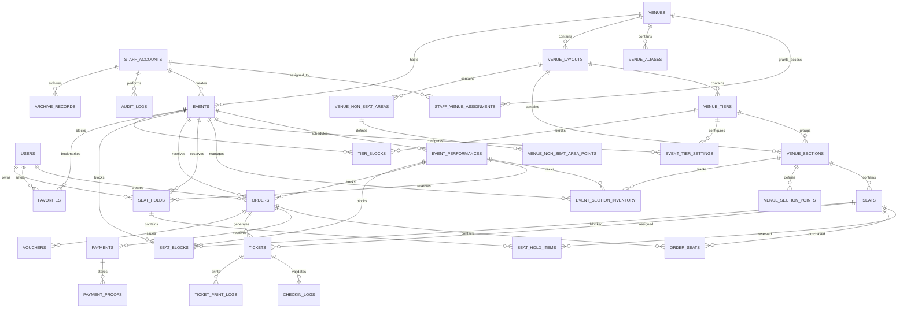

# CLICKET Final Database ERD and Schema Documentation

## Overview

This document defines the finalized database design for the CLICKET Event Ticketing and Venue Management System.

The system supports customer account management, staff administration, venue and seating layout management, event scheduling, seat reservations, order processing, payment verification, ticket issuance, ticket validation, venue check-in operations, favorites management, auditing, and archive management.

The finalized design prioritizes operational ticketing workflows, venue inventory control, payment review processes, and administrative accountability while preserving historical records for reporting and audit purposes.

---

# A. Final Entity Relationship Diagram

---

# B. Final Database Schema

## Table: users

Purpose:

Stores all customer accounts used for ticket purchases, seat reservations, favorites, and event participation.

Primary Key:

* id

Important Fields:

* name
* email
* password_hash
* status
* created_at
* updated_at

---

## Table: staff_accounts

Purpose:

Stores administrative, ticketing, venue, and operations personnel responsible for managing events, payments, inventories, ticket validation, and archive operations.

Primary Key:

* id

Important Fields:

* name
* email
* password_hash
* role
* status
* created_at
* updated_at

---

## Table: staff_venue_assignments

Purpose:

Defines venue-level permissions assigned to staff members.

Foreign Keys:

* staff_id → staff_accounts.id
* venue_id → venues.id

Key Permissions:

* create_events
* archive_events
* manage_tiers
* manage_seats
* review_payments
* print_tickets

---

## Table: venues

Purpose:

Stores all venues available for event hosting.

Primary Key:

* id

Important Fields:

* name
* slug
* status
* created_at
* updated_at

---

## Table: venue_aliases

Purpose:

Stores alternate names and searchable aliases associated with venues.

---

## Table: venue_layouts

Purpose:

Stores SVG-based venue seating maps and layout configurations.

Important Fields:

* layout_key
* variant
* category
* capacity
* svg_file
* map_type
* stage_label
* viewbox_x
* viewbox_y
* viewbox_width
* viewbox_height

---

## Table: venue_tiers

Purpose:

Defines venue pricing tiers such as VIP, Patron, Gold, Silver, and General Admission.

---

## Table: venue_sections

Purpose:

Defines seating sections within venue layouts.

---

## Table: venue_section_points

Purpose:

Stores polygon coordinates used for rendering section boundaries.

---

## Table: venue_non_seat_areas

Purpose:

Stores non-seating map regions such as stages, exits, aisles, and restricted zones.

---

## Table: venue_non_seat_area_points

Purpose:

Stores geometric coordinates for non-seat area rendering.

---

## Table: seats

Purpose:

Stores individual seats and seat metadata within venue sections.

---

## Table: events

Purpose:

Stores all published events available for ticket sales.

Important Fields:

* event_key
* title
* category
* artist
* company
* venue_id
* venue_layout_id
* base_price
* rating
* status

---

## Table: event_performances

Purpose:

Stores specific schedules and showtimes associated with events.

---

## Table: event_tier_settings

Purpose:

Stores pricing, capacity, and inventory settings per event tier.

---

## Table: event_section_inventory

Purpose:

Tracks seat inventory and availability at the section level.

---

## Table: seat_holds

Purpose:

Temporarily reserves seats during customer checkout sessions.

---

## Table: seat_hold_items

Purpose:

Stores seats included in a reservation hold.

---

## Table: orders

Purpose:

Stores completed, pending, approved, rejected, and archived ticket orders.

---

## Table: order_seats

Purpose:

Stores seat-level purchase information and pricing snapshots.

---

## Table: payments

Purpose:

Stores payment transactions and payment review workflow records.

---

## Table: payment_proofs

Purpose:

Stores uploaded proof-of-payment documents.

---

## Table: tickets

Purpose:

Stores issued event tickets and validation credentials.

---

## Table: ticket_print_logs

Purpose:

Tracks ticket printing history and reprint activity.

---

## Table: checkin_logs

Purpose:

Tracks ticket scanning and venue entry validation.

---

## Table: seat_blocks

Purpose:

Stores administrator-created seat restrictions and seat-level inventory blocks.

---

## Table: tier_blocks

Purpose:

Stores administrator-created tier-level sales restrictions.

---

## Table: favorites

Purpose:

Stores user-bookmarked events.

---

## Table: vouchers

Purpose:

Stores issued voucher records associated with orders and ticketing operations.

---

## Table: audit_logs

Purpose:

Maintains a complete audit trail of administrative actions.

---

## Table: archive_records

Purpose:

Stores archive and restoration records for system entities.